# NYC and JFK Airport Taxi Data Analysis
Exploring and visualising New York City Taxi trip data (2011-2025). With modelling of daily and hourly taxi pick up counts for JFK Airport using linear regression, XGBoost and linear regression boosted on the residuals.  

## Table of Contents
- [Objective](#objective)
- [Data](#data)
- [Results / Key Findings](#results--key-findings)
  - [EDA](#eda)
  - [Modelling](#modelling)
  - [SHAP and Reduced Feature Set](#shap-and-reduced-feature-set)
  - [Bayesian Hyperparameter Tuning](#bayesian-hyperparameter-tuning)
  - [Conclusion](#conclusion)
- [Project Overview](#project-overview)
  - [1_EDA.ipynb](#1_edaipynb)
  - [2_data_processing.ipynb](#2_data_processingipynb)
  - [3_EDA_JFK.ipynb](#3_EDA_JFKipynb)
  - [4_modelling.ipynb](#4_modellingipynb)
  - [5_model_selection.ipynb](#5_model_selectionipynb)
  - [Streamlit App](#streamlit-app)
  - [Notes on Hyperparameter Tuning](#notes-on-hyperparameter-tuning)
- [Usage](#usage)
  - [Launching the Streamlit App](#launching-the-streamlit-app)
  - [Using AWS for Hyperparameter Tuning](#using-aws-for-hyperparameter-tuning)
  - [Testing](#testing) 


## Objective

Our objective was to do some basic exploration of NYC taxi data using choropleths. Then to explore fitting various models to two time series for the taxi pick up count at JFK Airport, one daily and one hourly. One potential use case for these models would be the coordination of the taxi fleet, so bringing more Yellow Taxis closer to JFK Airport during predicted peak times, and distributing them throughout the rest of the city when expected pick ups are low. 

## Data 

We use the Yellow Taxi data provided by the NYC Taxi and Limousine Commission (TLC). The datasets themselves are reasonably large parquet files that record information about every single taxi trip for each month and year. In this project we primarily focus on tpep_pickup_date_time which is the time the taxi meter was engaged, so we treat this as the time of the pick up. As well as PULocationID which is the taxi zone the pick up occurred in. We use just these two columns to construct our time series for modelling. There is a data dictionary for the parquet files here: [Yellow Taxi Data Dictionary](https://www.nyc.gov/assets/tlc/downloads/pdf/data_dictionary_trip_records_yellow.pdf). For context NYC is divided into various taxi zones by the TLC. The taxi zones themselves are split into four boroughs: [Bronx](https://www.nyc.gov/assets/tlc/images/content/pages/about/taxi_zone_map_bronx.jpg), [Brooklyn](https://www.nyc.gov/assets/tlc/images/content/pages/about/taxi_zone_map_brooklyn.jpg), [Manhattan](https://www.nyc.gov/assets/tlc/images/content/pages/about/taxi_zone_map_manhattan.jpg), [Queens](https://www.nyc.gov/assets/tlc/images/content/pages/about/taxi_zone_map_queens.jpg) and [Staten Island](https://www.nyc.gov/assets/tlc/images/content/pages/about/taxi_zone_map_staten_island.jpg). TLC have provided maps for these zones that you can view by clicking on each of the previous boroughs. There is a .shp file that contains geospatial data for the taxi zones that we will use when creating our choropleths during our EDA. There is also a taxi zone lookup csv that allows you to map taxi zone location IDs (which are what is stored inside the Yellow Taxi data) to the zone's name, borough, and service zone.

Data source: [NYC TLC Trip Record Data](https://www.nyc.gov/site/tlc/about/tlc-trip-record-data.page), 
via [NYC Open Data](https://opendata.cityofnewyork.us/).  
© City of New York. Data made available under the NYC Open Data Terms of Use.

## Results / Key Findings

### EDA

Initially we create choropleths of taxi pick up and drop off counts by taxi zone for the entire of NYC. The key patterns we spot doing this is both there is a general decrease across nearly all taxi zones in Yellow Taxi use since 2011. This is likely due to the introduction of services like Uber to NYC that have taken some of the demand away from Yellow Taxis. The other important thing for our modelling is we spot that it appears in most zones taxi pick ups and drop offs change substationally throughout the year. Below are screen grabs from the projects streamlit app showing some of this folium choropleths:

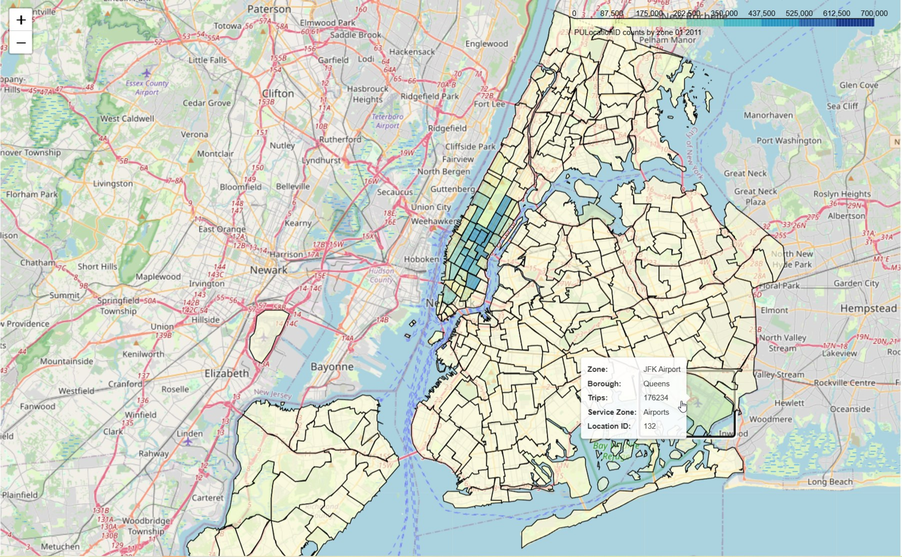
*Figure 1: Choropleth showing taxi picks ups for whole of NYC in January 2011*  

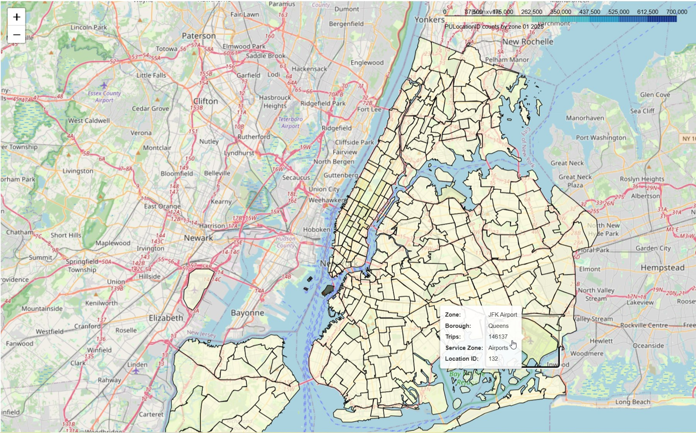
*Figure 2: Choropleth showing taxi pick ups for whole of NYC in January 2025. Using same scale as figure 1 allows us to see the overal decline in taxi use, particularly in the Manhattan borough.*  

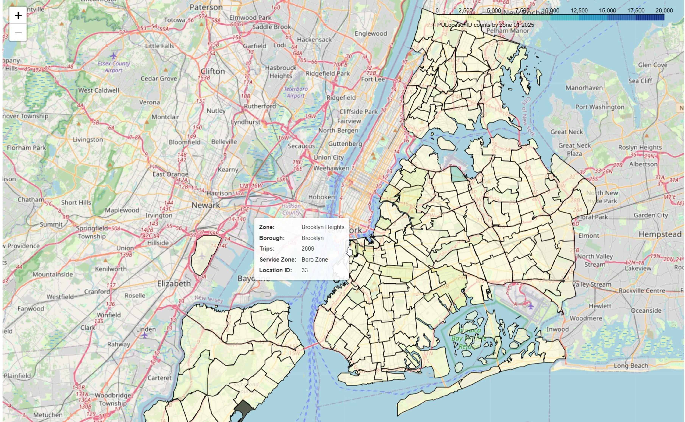
*Figure 3: Choropleth showing taxi pick ups for some of NYC in January 2025. Here we use a much smaller scale (max 20,000) and have dropped zones and boroughs over this scale.*  
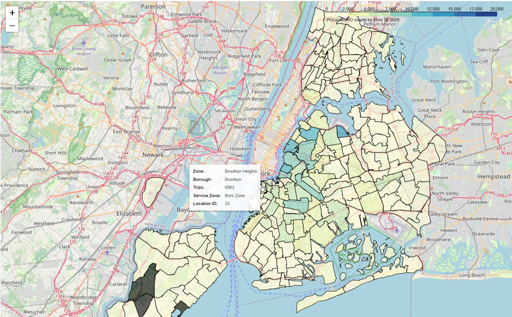
*Figure 4: Choropleth showing taxi pick ups for some of NYC in June 2025, using same scale as figure 3. These two figures highlight what appears to be a seasonal increase in taxi use across the city from January to June.*  

We then shift our focus towards JFK Airport where we are going to attempt to model both daily and hourly Yellow Taxi pick ups. We investigate both the daily and hourly time series, fitting rolling averages to see if we can potentially identify any seasonality to the data that was hinted at from our choropleths. We identify at least weekly and yearly seasonality for the daily time series, and daily and weekly for the hourly time series. We compute the significant lags for both time series using autocorrelation. Plots for the daily and hourly time series, the rolling averages and autocorrelation are shown below:

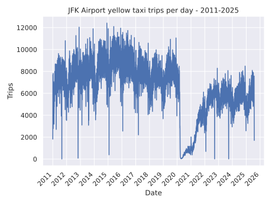  
*Figure 5: Time seires plot for daily Yellow Taxi pick ups at JFK Airport 2011-2025*  

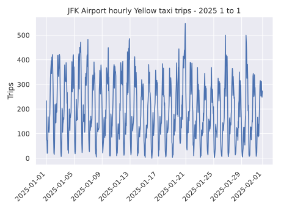  
*Figure 6: Time series plot for hourly Yellow Taxi pick ups at JFK Airport for January 2025*  

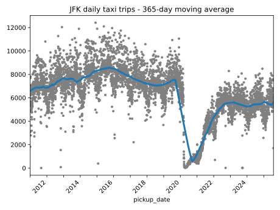  
*Figure 7: 365 day rolling average for daily taxi pick ups at JFK Airport.*  

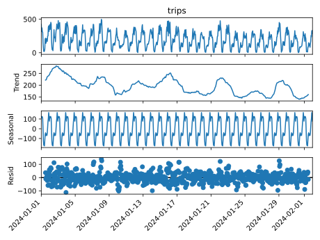  
*Figure 8: Statsmodels seasonal decompose for a 24 hour frequency in the hourly time series for January 2024*  

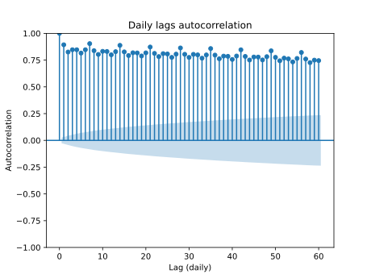  
*Figure 9: Partial daily lag autocorrelation plot*  

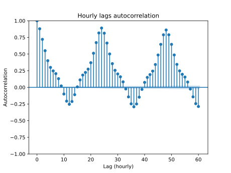  
*Figure 10: Partial hourly lag autocorrelation plot*  

### Modelling

We fit roughly three strands of model to both time series. Linear regression, XGBoost, and boosted linear regression (linear regression with XGBoost fitted to residuals). The models are fitted to the significant lags found in the EDA section, we take a subset of these lags for the hourly case as there are over 10,000 hourly lags found during our EDA and we don't have the computational resources to use all 10,000 in our models. We also add fourier features for the seasonality we identified. For the daily time series we do 10 harmonics for yearly seasonality, 5 for weekly. For the hourly time series we do 5 harmonics for weekly seasonality 5 for hourly seasonality.  

We measure model performance by mean absolute error (MAE) on different forecast steps starting from different points in the test data, and then taking an average MAE across these starting points. We compare all the models relative to a naive baseline that simply predicts the current taxi pick up count to be what it was one time step ago (so one hour or day ago). For the daily time series we look at 7, 30 and 60 day forecasts. For the hourly time series we look at 24, 48 and 168 hour forecasts.  

Initially we find that for daily time series the boosted linear regression with order 1 trend (hybrid_order1 in notebooks) performs the best for a 7 day forecast with a 31.6% improvement on the naive baseline. Then linear regression with order 2 trend performs the best for both the 30 and 60 day forecast with a 34.1% and 26.5% improvement on naive baseline respectively.  

For the hourly time series we find that for the 24 hour and 48 hour forecast the best model is linear regression with no trend, which results in a 38.6% and 37.7% improvement on naive baseline respectively. For the 168 hour forecast we find that the boosted linear regression with no trend performs the best with a 35.3% improvement on naive baseline. Some plots showing the models:

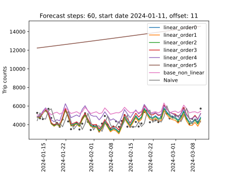  
*Figure 11: 60 day forecast with linear regressions (linear_order2 means trend goes up to 2nd order), XGBoost (base_non_linear) and the naive baseline (Naive)*  

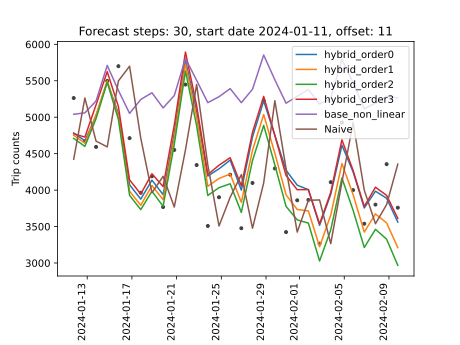  
*Figure 12: 30 day forecast with the boosted linear regressions (hybrid models), XGBoost (base_non_linear) and the naive baseline (Naive)*  

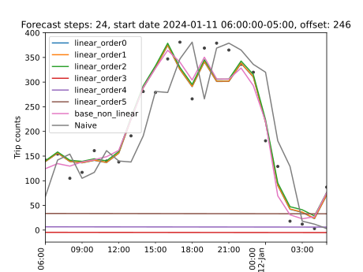  
*Figure 13: 24 hour forecast with the linear regressions, XGBoost and naive baseline*  

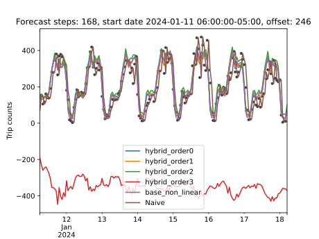  
*Figure 14: 168 hour (1 week) forecast with the boosted linear regressions (hybrid models), XGBoost and naive baseline*  

#### SHAP and Reduced Feature Set

We then move on to compute SHAP values for the models and rank features by their mean absolute SHAP value. We use this to produce a smaller feature set by taking just the top 30 by mean absolute SHAP value (technically slightly more, as if one of the fourier features is in the top 30 we take all fourier features of the same period). In some cases this results in an over 13 fold decrease in the number of features for the model. We test whether the models perform as well on this reduced feature set using the same regime as in our modelling section. We find that the XGBoost and boosted linear regression models perform similarly, if not slightly better on the reduced feature set. However in the purely linear regression case there is a noticeable decrease in model performance on the reduced feature set particularly in the daily time series case. We choose to keep the reduced feature set for XGBoost and the boosted linear regression models, but keep the full feature set for the linear regressions. One of the interesting things worth noting is that the fourier features don't appear in the top 30 for several models, particularly for the linear regressions which is interesting as I had intitially expected them to be well suited to modelling seasonal patterns in the data. Below are some plots showing the models both on the full and reduced feature set, highlighting their similar performance. As well as a SHAP summary plot showing the top 30 features for one of the models:

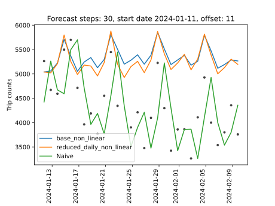  
*Figure 15: 30 day forecast with the XGBoost model trained both on the full and reduced feature sets (reduced_daily_non_linear is trained on the reduced feature set), plus naive baseline*  

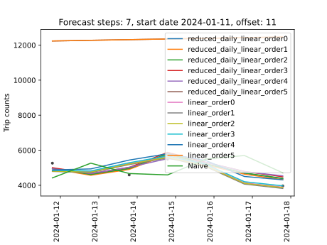  
*Figure 16: 7 day forecast with the linear regressions trained on both the full and reduced feature sets*  

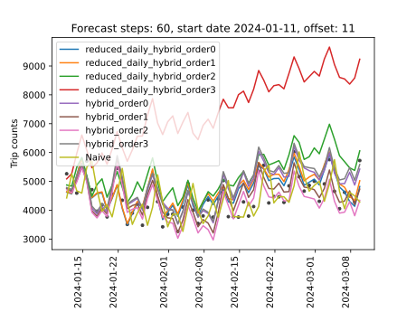  
*Figure 17: 60 day forecast with the boosted linear regressions (hybrid models) trained on both the full and reduced feature sets*  

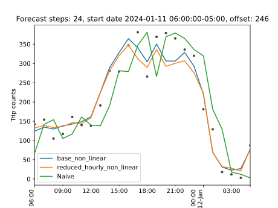  
*Figure 18: 24 hour forecast with the XGBoost model trained on both the full and reduced feature sets*  

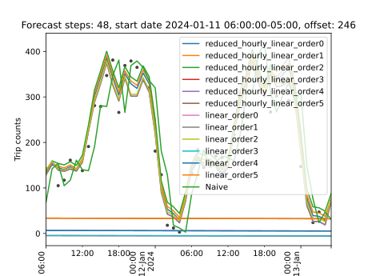  
*Figure 19: 48 hour forecast with the linear regressions trained on both the full and reduced feature sets*  

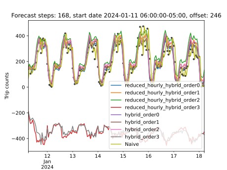  
*Figure 20: 168 hour forecast with the boosted linear regressions trained on both the full and reduced feature sets*  

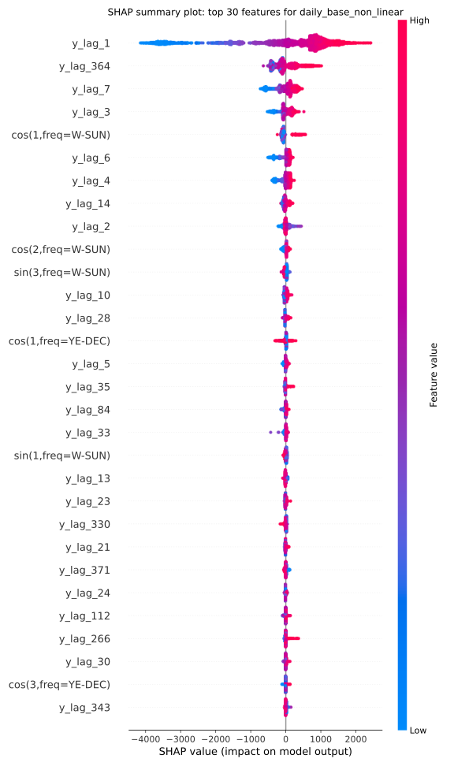  
*Figure 21: SHAP summary plot showing top 30 features for XGBoost on the daily time series by mean absolute SHAP value*  

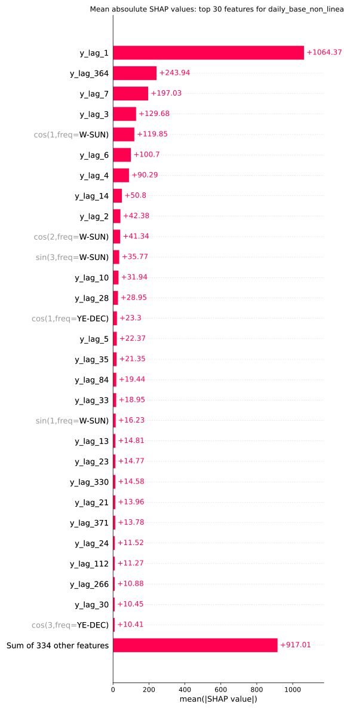  
*Figure 22: Bar plot showing the mean absolute SHAP values for each of the features in figure 21*  

### Bayesian Hyperparameter Tuning

Finally we move on to tune the hyperparameters for all XGBoost models (so both the standalone and the one included inside the boosted linear regressions). We use Bayesian hyperparameter tuning with Optuna. This time we are now focused exclusively on optimising for the 30 day forecast in the daily time series and the 168 hour forecast in the hourly time series. We also test to see whether tuning on the pre COVID data makes any difference, the line of thinking being that because of the unusual data during COVID we don't want the model to overfit to those unusual trends if our goal is prediction into the future. Overall we get rather mixed and inconclusive results from hyperparameter tuning. It does improve some models, notably making the boosted linear regression with order 0 our best overall model for the 7 day forecast. However in other cases tuning actually makes the models significantly worse, for example when tuning XGBoost on the daily time series, the pre COVID regime increases the models' MAE. In some cases tuning pre COVID is superior, for example in the hourly hybrid case. Other times including COVID makes tuning perform better, for example the hourly XGBoost case. In the notebooks we have outlined why perhaps this version of hyperparameter tuning wasn't as successful as we had hoped. With some potential ideas for how it could be improved, although this is beyond the scope of this project. Below are some of the plots showing the tuned models, plotted alongside some of their untuned counterparts:  

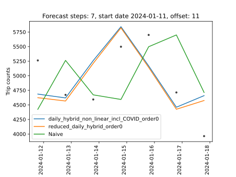  
*Figure 23: 7 day forecast showing the tuned hybrid model alongside its untuned counterpart*  

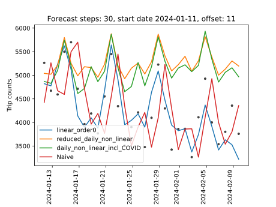  
*Figure 24: 30 day forecast showing the tuned non linear model alongside its untuned counterpart*  

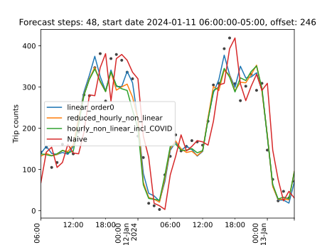  
*Figure 25: 48 hour forecast showing the tuned non linear model alongside its untuned counterpart*  

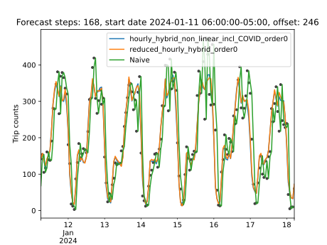  
*Figure 26: 168 hour forecast showing the tuned hybrid model alongside its untuned counterpart*  

### Conclusion

We conclude with three of the best models we produced, most suited to potential real world use cases. The best model for a 30 day forecast, which would allow for medium term predictions of taxi use. The best model for a 24 hour forecast for short term predictions on taxi use, with the idea of running this model regularly to update predictions. The final model will be for a 168 hour forecast for short to medium term predictions of taxi use.  

The models are as follows, we give their name, the features they are trained on and their percentage improvement on the naive baseline by our average MAE metric we describe earlier.  

For the 30 day forecast, the best model is a linear regression with a 2nd order trend, trained on all 336 lags that we find significant (see notes below for a full list), yearly and weekly fourier features with 10 harmonics for yearly and 5 for weekly. It provides a 34.1% improvement on the naive baseline by average MAE.  

For the 24 hour forecast, the best model is a boosted linear regression with 0th order trend (so no trend), trained on a reduced feature set found using SHAP values. This means no fourier features and only on 30 lags (see notes below for a full list). This provides a 40.6% improvement on the naive baseline by average MAE.  

For the 168 hour forecast, the best model is the same boosted linear regression with 0th order trend, again trained on the same 30 lags. This time it's improvment on the naive baseline is 32.8%.

Below we plot all three of the best forecasts using our very own Streamlit app:  

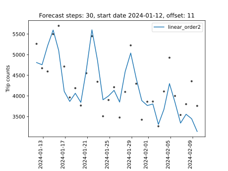  
*Figure 27: 30 day forecast of the linear regression with 2nd order trend (linear_order2)*  

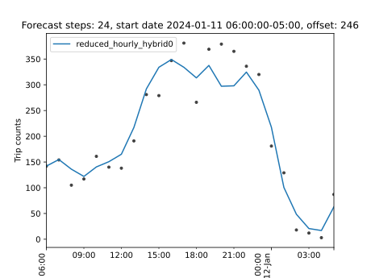  
*Figure 28: 24 hour forecast of the boosted linear regression, order 0, on the reduced feature set (reduced_hourly_hybrid_order0)*  

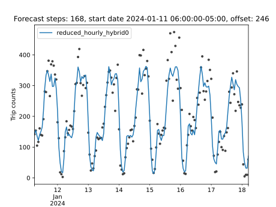  
*Figure 29: 168 hour forecast of the boosted linear regression, order 0, on the reduced feature set (reduced_hourly_hybrid_order0)*  

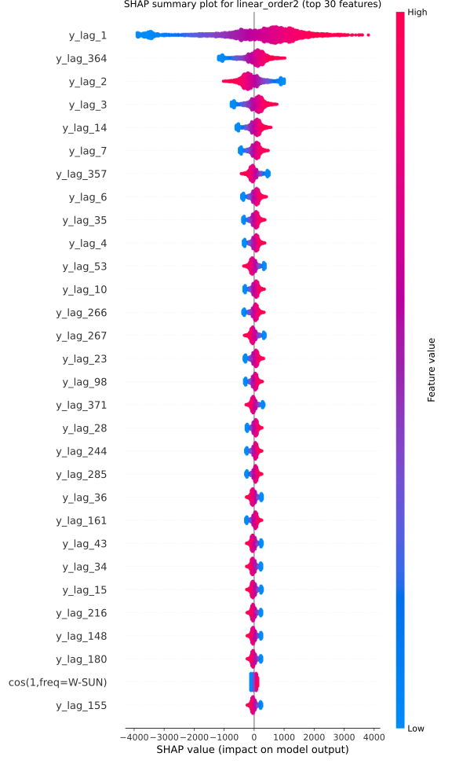  
*Figure 30: SHAP summary plot for the daily linear regression with 2nd order trend (linear_order2)*  

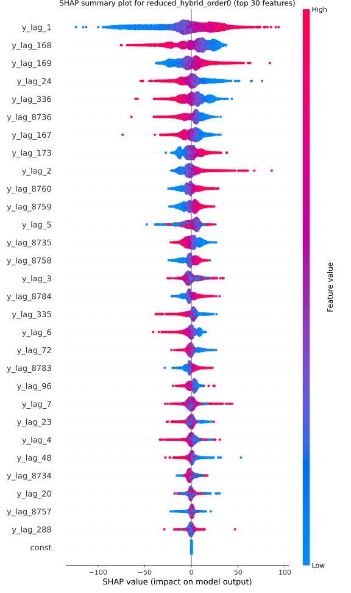  
*Figure 31: SHAP summary plot for the boosted linear regression, order 0, on the reduced feature set (reduced_hourly_hybrid_order0)*  

One of the interesting parts of this project is that it shows that a simple linear regression on a reasonably well thought out feature set has actually outperformed more complicated/advanced models like XGBoost (sometimes considerably). Even in the hourly case the XGBoost componenet of the model plays a more supporting role being only fitted onto the linear regressions residuals. Extensions that I didn't manage to implement would have been adding features to indicate to the model when COVID was to potentially allow to offset the rather unusal and sudden decrease in taxi use. As well as the adding of additional features for example airport arrival predictions or say number of incoming aircraft to JFK Airport etc etc. I hope you found this interesting and enjoyed reading, below the conclusion there is a project overview explaining some of the notebooks in more detail. There is a usage section outlining how to run the project on your machine, and potentially in the cloud for hyperparameter tuning. Finally there is a small test section explaining how to run the projects unittests.

#### Lag lists

Below are the list of lags mentioned above. The first are the 30 lags used by boosted linear regression for the 24 hour and 168 hour forecasts. The second is the full 336 lags used by the linear regression for the 30 day forecast.

The 30 hourly lags of the boosted linear regression:
[1, 2, 3, 4, 5, 6, 7, 20, 23, 24, 48, 72, 96, 167, 168, 169, 173, 288, 335, 336, 8734, 8735, 8736, 8757, 8758, 8759, 8760, 8783, 8784]

The 336 daily lags of the linear regression:
[1, 2, 3, 4, 5, 6, 7, 8, 9, 10, 11, 12, 13, 14, 15, 16, 17, 18, 19,
20, 21, 22, 23, 24, 25, 26, 27, 28, 29, 30, 31, 32, 33, 34, 35, 36, 37, 38,
39, 40, 41, 42, 43, 44, 45, 46, 47, 48, 49, 50, 51, 52, 53, 54, 55, 56, 57,
58, 59, 60, 61, 62, 63, 64, 65, 66, 67, 68, 69, 70, 71, 72, 73, 74, 75, 76,
77, 78, 79, 80, 81, 82, 83, 84, 85, 86, 87, 88, 89, 90, 91, 92, 93, 94, 95,
96, 97, 98, 99, 100, 101, 102, 103, 104, 105, 106, 107, 108, 109, 110, 111,
112, 113, 114, 115, 116, 117, 118, 119, 120, 121, 122, 123, 124, 125, 126, 127,
128, 129, 130, 131, 132, 133, 134, 135, 136, 137, 138, 139, 140, 141, 142, 143,
144, 145, 146, 147, 148, 149, 150, 151, 152, 153, 154, 155, 156, 157, 158, 159,
160, 161, 162, 163, 164, 165, 166, 167, 168, 169, 170, 171, 172, 173, 174, 175,
176, 177, 178, 179, 180, 181, 182, 183, 184, 185, 186, 187, 188, 189, 190, 191,
192, 193, 194, 195, 196, 197, 198, 199, 200, 201, 202, 203, 204, 205, 206, 207,
208, 209, 210, 211, 212, 213, 214, 215, 216, 217, 218, 219, 220, 221, 222, 223,
224, 225, 226, 227, 228, 229, 230, 231, 232, 233, 234, 235, 236, 237, 238, 239,
240, 241, 242, 243, 244, 245, 246, 247, 248, 249, 250, 251, 252, 253, 254, 255,
256, 257, 258, 259, 260, 261, 262, 263, 264, 265, 266, 267, 268, 269, 270, 271,
272, 273, 274, 275, 276, 277, 278, 279, 280, 281, 282, 283, 284, 285, 286, 287,
288, 289, 290, 291, 292, 293, 294, 295, 296, 297, 298, 299, 300, 301, 302, 303,
304, 305, 306, 307, 308, 309, 310, 311, 312, 313, 314, 315, 316, 318, 319, 321,
322, 323, 325, 326, 328, 329, 330, 333, 336, 343, 350, 357, 364, 371]

## Project Overview

The project is setup around the five notebooks you can find in the notebooks directory. I have written a python package inside the src directory called jfk_taxis that contains helper functions for the notebooks that do a lot of the heavy lifting behind the scenes. We will briefly explain roughly what each notebook does here. Then later on in the README comment on our results/findings.

### 1_EDA.ipynb

This notebook is focused on doing some inital EDA of taxi drop offs and pick ups in the entire of NYC. We create interactive folium choropleths across both the years and months from 2011-2025, and comment on a few things that appear to be going on within the data.

### 2_data_processing.ipynb

This notebook handles the processing of the raw parquet files into the daily and hourly time series of taxi pick ups at JFK Airport.

### 3_EDA_JFK.ipynb

This notebook does some intial EDA into the time series themselves. Mostly to try and work out what seasonality might be within the time series (yearly, weekly, daily etc) and also to find what lags would be a good idea to use as features. 

### 4_modelling.ipynb

This notebook does our inital modelling. We start with three strands of model: linear regression, XGBoost (referred to as the non_linear model in our notebooks) and a hybrid model which is linear regression with boosted residuals (so linear regression with XGBoost fitted to the residuals of the linear regression). We use the features found in the previous notebook and split the data into a training and test set. For the XGBoost models (so both standalone and the one found in the boosted linear regression) we fit using early stopping on a validation set (10% of the training set) to help reduce overfitting. To assess the quality of the model on the test set we compute the MAE for multi step forecasts of different step length (so for daily step lengths of 7, 30, 60 and for hourly 24, 48 and 168). As well as starting at different offsets throughout the test series, i.e. different starting dates for the forecast. We then take the average MAE across all the offsets and use that as a score to compare the models on each different step length. 

### 5_model_selection.ipynb

In this notebook we first compute the SHAP values for some of the best models from the previous notebook. We use this to create a reduced feature set by ranking feature importance by mean absolute SHAP value. We then test that this reduced feature set captures enough of the original signal to be useful. Using the same model evaluation scheme as in the previous notebook. Then we perform Bayesian hyperparamter tuning with Optuna to tune all the XGBoost models. The objective function for optuna will split the training data into 5 train test folds of increasing size. It will then train the model on the training part of the fold and run the same forecast regime used in 4_modelling on the test part of the fold. Returning an average MAE across the offsets for that fold. The objective function then returns the average of these average MAEs across all 5 folds. This is what Optuna will optimise for. We then run the same forecasting scheme as in 4_modelling to see if the tuning has improved the models. Finally we use the evaluation scheme as in the previous notebook to find the best model for the two time series cases: daily and hourly.

### Streamlit App

I have also made a Streamlit app for the project that can be found in the app directory. There are instructions on how to run the app in the Usage section. The app allows you to generate custom choropleths as in the EDA section, with custom scales, dropping custom zones and boroughs for any year/month from 2011 to 2025. There is also a model building section where you can build, train and plot any of the models used in the project. As well as create your own models with custom lags and fourier features. This section also allows you to compute and display a SHAP summary plot for your models like in figure 31. 

#### Notes on Hyperparameter Tuning

Hyperparameter tuning can take a very long time depending on your machine. I have provided pretuned hyperparameters inside the results/tuned_hyperparams directory. To use them when you run 5_model_selection to avoid having to tune the hyperparameters yourself, simply copy the files into saved_objects and run the notebook skipping the hyperparameter tuning steps (there are instructions in the notebook on how to do this).

## Usage

Clone the repository:
```bash
git clone https://github.com/William-Ogilvie/NYC-taxi-data-analysis.git
cd NYC-taxi-data-analysis
```

There is a Dockerfile inside the repository that you can build an image from. It has a micromamba base that will have CUDA installed by default on Ubuntu. There are then two enviroment YAML files that you can choose to build from, environment_cpu.yml and environment_gpu.yml. The GPU version will install the version of XGBoost with GPU support, the CPU version just runs on the CPU. On my machine there was a noticeable improvement in fit times when using the GPU and the project is setup so that you can use either. To specify whether you want GPU or CPU whilst building the docker image use --build-arg ENV_FILE=environment_gpu.yml/enviornment_gpu.yml.

The full Docker commands are below:

```bash
docker build -t jfk-taxi:gpu --build-arg ENV_FILE=environment_gpu.yml .
```
or
```bash
docker build -t jfk-taxi:cpu --build-arg ENV_FILE=environemnt_cpu.yml .
```

To then run a container you will want to bind mount the current working directory to the container. This is because you want to be able to download the data as well as save and load .pkl files later on in the project. The project consists of several notebooks so we will setup the container so that you can access jupyter lab, by mapping ports 8888 to each other from the container and the host. The project also has a streamlit app that demos some of the EDA and model building, so we will map ports 8501 to each other on the container and the host. If you are using your GPU for training you will also need to give the container access to it. It is also worth noting that some of the project can be slightly memory intensive so it is worth ensuring your container will have access to at least 8 GBs of RAM.

So the full Docker run command is as follows:
```bash
docker run -it --rm --gpus all -p 8888:8888 -p 8501:8501 --mount type=bind,src="$(pwd)",dst=/app jfk-taxi:gpu
```
or
```bash
docker run -it --rm -p 8888:8888 -p 8501:8501 --mount type=bind,src="$(pwd)",dst=/app jfk-taxi:cpu
```
ai
Now we will need to do some initial setup before we can run the notebooks. First we will need to install the package jfk_taxis which is located inside src/jfk_taxis. This package contains helper functions that do most of the heavy lifting and make our notebooks more readable. It also has unittests for all modules that you can find in the tests directory. To install the package use the following command whilst in the /app dir:

```bash
pip install -e . 
```

Then we need to setup the config file to account for whether or not we should use GPU during training. It will also create all necessary directories for the project if they do not already exist. Go to the scripts directory and run setup.py. This performs a small test to determine whether XGBoost has been installed with CUDA support and updates the config.yml file accordingly (which can be found in config/config.yml). So run the following commands:

```bash
cd scripts
python setup.py
```

Then we need to download the data. Within scripts there is a file called get_parquet.py. This scrapes https://www.nyc.gov/site/tlc/about/tlc-trip-record-data.page using BeautifulSoup to get the urls to download the parquet files containing the taxi data, the .shap file for the taxi zones, and the taxi zone lookup CSV. This will then be saved to parquet_files.txt. So first run this script:

```bash
python get_parquet.py
```

Then we have a small bash script called download_and_extract.sh that just loops through all the files in parquet_files.txt and downloads them. You may need to run the following command outside of the container due to changing the permissions of the file:

```bash
chmod +x download_and_extract.sh
```

Then run the script with:

```bash
./download_and_extract.sh
```

If the above commands fail it may be due to Windows line endings. So install dos2unix to convert to Unix format and run the above commands again:

```bash
sudo apt install dos2unix
dos2unix download_and_extract.sh
```
If you are using WSL and have saved the project to the Windows part of your machine you may have errors due to missing write permissions. It may be worth temporarily copying the project to your WSL home directory, downloading the files and then copying the downloaded files back into the Windows project. The downloaded files go into the data/raw directory. So potentially something like this:

```bash
cp -r "mnt/c/NYC-taxi-data-analysis/" ~/
```
Run the bash script and then:
```bash
cp -r "~/data/raw/" "mnt/c/NYC-taxi-data-analysis/data/raw/"
rm -r "~/NYC-taxi-data-analysis"
``` 

Once the data has been downloaded you will want to start with the notebooks at least initially to process the taxi data. Before moving on to the Streamlit app. To launch Jupyter Lab in the container run the following command from the project root (so mambauser@USER_NAME:/app):

```bash
jupyter lab --ip=0.0.0.0 --no-browser --allow-root --NotebookApp.token=''
```

You will then be able to open Jupyter Lab on your host machine by visiting http://127.0.0.1:8888/ in a browser. From here you will be able to see the project's notebooks inside the notebooks directory. The notebooks are numbered from 1 to 5 and will walk through and explain the project in order. There is a folder of rough notebooks that I have kept from the initial exploration of the data for completeness, although they may have errors within them. Once you have completed notebook 2_data_processing.ipynb the time series data will now have been processed allowing you to launch the Streamlit app. However it is recommended to complete notebooks 3 through 5 first as they will provide better context for the app itself. 

### Launching the Streamlit App

To then launch the Streamlit app run the following commands:

```bash 
cd app
streamlit run home.py --server.address 0.0.0.0 --server.port 8501 --server.headless true
```

You will then be able to view the app on the host machine by going to http://127.0.0.1:8501/ in a browser. The app home page will give a brief explanation of how the app works and hopefully from reading notebooks 1_EDA.ipynb, 4_modelling.ipynb and 5_model_selection.ipynb you can understand and follow what parts of the project it is demonstrating.

### Using AWS for hyperparameter tuning

One of the things I found on my machine was that the Bayesian hyperparameter tuning in 5_model_selection.ipynb took a long time for a large number of trials. So I used an AWS EC2 instance to run the tuning over the course of several days whilst I worked on other parts of the project. We will briefly explain how to do this here. 

First you will need to create an S3 bucket to store both the time series data but also the results of the hyperparameter tuning. I named the S3 bucket jfk-taxi-data-william-ogilvie. If you choose a different name you will need to manually alter the bash script hyperparam_tuning_bash.sh, change BUCKET to the name of your bucket. Inside the S3 bucket place the full time series data (ts_daily2011-2025.csv, ts_hourly2011-2025.csv) inside a data/time_series directory. 

You will need to create an IAM role with the AmazonS3FullAccess policy if you do not have one already. Then create the EC2 instance. I decided to use the Deep Learning Base AMI with Single CUDA (Ubuntu 22.04) AMI as it comes with git, Docker and the AWS CLI pre installed and configured. I only have access to CPU instances so wasn't able to test the GPU functionality on AWS, but this instance should allow you to make use of the GPU if you would like. Make sure you give it the IAM role with the AmazonS3FullAccess policy. 

Now if you are going to use a GPU instance you will need to modify the hyperparam_tuning_bash.sh script. Specifically change USE_GPU to be 1 rather than 0. Then change ENV to environment_gpu.yml rather than environment_cpu.yml. You may also want to change the name of the Docker image under IMAGE for completeness. 

Then once you connect to the instance run the following commands inside the home directory:

```bash
mkdir -p project logs
cd project 
git clone https://github.com/William-Ogilvie/NYC-taxi-data-analysis.git
```

We will be using tmux to run the hyperparam_tuning_bash.sh script even when we disconnect from the instance. So we will need to install it:

```bash
sudo apt-get update && sudo apt-get install -y tmux
```

We will create a new tmux session:

```bash
tmux new -s hyperparam_tuning
```

Inside the tmux session we will then run the hyperparm_tuning_bash.sh script inside the scripts directory. This script will load the data from the S3 bucket. It will then build the Docker image and run a container of this image. Inside this container it will install the jfk_taxis package, run scripts/setup.py and then run scripts/hyperparam_tuning.py. It will produce logs and save them into the logs directory on the instance, as well as save the tuned hyperparameters into outputs/$RUN_ID in your S3 bucket.

Run the hyperparam_tuning_bash.sh script inside the tmux session:

```bash
cd NYC-taxi-data-analysis/scripts
bash hyperparam_tuning_bash.sh 2>&1
```

You can then download the tuned hyperparameters from the S3 bucket and place them inside the data/saved_objects folder on your local version of the repository. To see them plotted run the first five cells of the 5_model_selection.ipynb notebook. Then run all remaining cells from the following cell:

```python
# Load signatures
hyper_sig = load_obj("hyperparam_sigs")

# Dict of hyperparams
hyper_dict = {}

# Load the hyperparams for each model
for sig in hyper_sig:
    hyper_params = load_hyperparams(sig)
    hyper_dict[sig] = hyper_params# Load signatures
hyper_sig = load_obj("hyperparam_sigs")
```

### Testing

There are unittests for the custom package jfk_taxis. They are written for pytest if you would like to run them simply run the following commands:

```bash
cd tests
pytest
```

